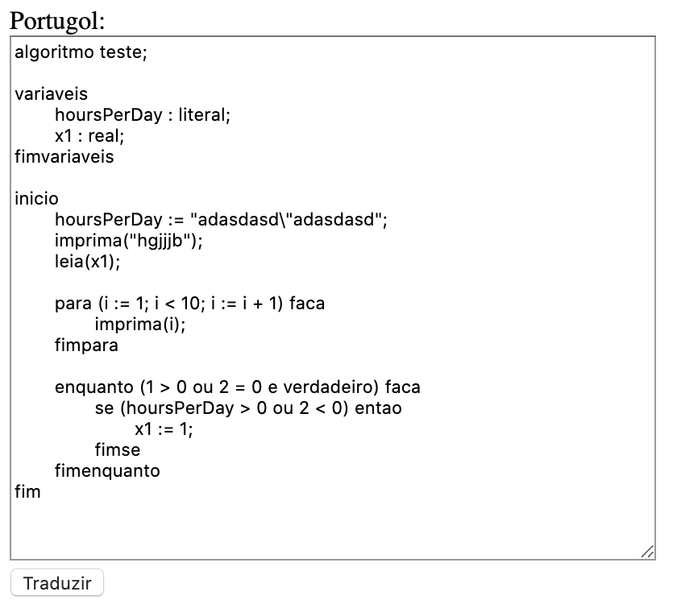
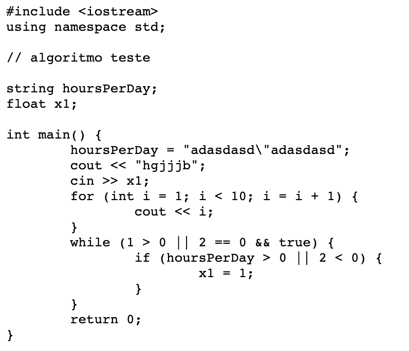

# Portugol-C++
Tradutor de Portugol para C++ feito somente em Javascript puro

## Entrada

## Saida

# Funcionamento
Da mesma forma que um compilador, o tradutor Portugol-C++ faz uma análise léxica do código em Portugol, faz o parsing e, após, transforma o código analisado no seu equivalente em C++.
O código é separado em 3 arquivos: Lexer, Parser e Translator, que faz a análise seguindo a sequência descrevida anteriormente.

## Estruturas e blocos
O Portugol-C++ aceita os principais blocos e estruturas de código, as palavras-chave são:
- inicio
- fim
- se
- fimse
- senao
- entao
- enquanto
- fimenquanto
- para
- fimpara
- faca
- variaveis
- fimvariaveis
- algoritmo
